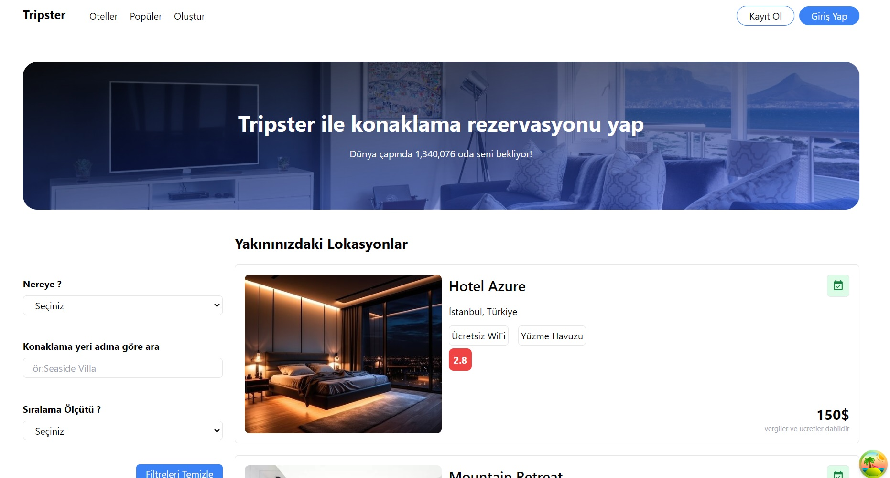

# Tanstack_query_Hotels_App

The Hotels App is a modern, responsive React application that allows users to search, filter, and explore hotels. It provides features for creating new hotel entries and discovering popular accommodations. The application utilizes powerful libraries such as React Query, Axios, Formik, and React Toastify to enhance performance and user experience. Users can view detailed information about each hotel, including images, amenities, and pricing. TypeScript ensures type safety, while Tailwind CSS is used for responsive design. Data fetching (GET) is cached with TanStack Query, and data submission (POST/PUT/DELETE) manages user input to communicate with the backend. This setup offers an efficient and user-friendly experience, particularly beneficial for managing intensive hotel data and user interactions.

# Tools and Libraries Used

- React
- React Router DOM
- Axios
- Formik
- React Query
- React Query Devtools
- React Toastify
- React Icons
- Tailwindcss

# API

- https://docs.coincap.io/

# Screenshots

## Gif

